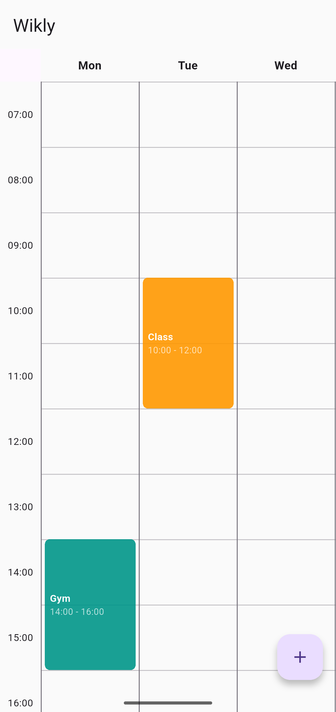
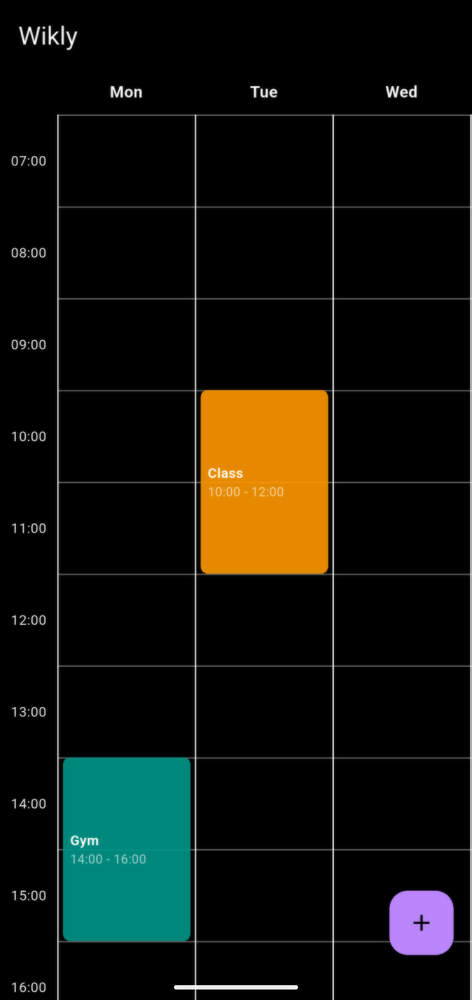

# 📅 Wikly – Weekly Timetable App

  

  

  

Wikly is a simple, lightweight Flutter app for managing and visualizing your weekly schedule.  
It allows you to create, view, and delete events across a **7-day timetable**, with smooth scrolling
and a clean Material 3 UI.

---

## ✨ Features

- 📖 **Weekly grid view** (Mon–Sun) from **07:00 to 22:00**
- ➕ **Add events** with:
    - Title
    - Day of the week
    - Start & end time
    - Custom color
- 🗑 **Delete events** with a long press
- 🌗 **Light & Dark mode** support
- 📂 **Persistent storage** with SQLite (`sqflite` package)

---

## 📸 Screenshots

Here are some previews of the app in action:

    
    

---

## 📖 Usage

1. **Open the app** → see a blank timetable (if no events yet).
2. Tap the ➕ **Floating Action Button** → create a new event.
3. Fill in details → save → event appears in the timetable.
4. Long-press on any event → delete it.

---

## 📜 License

This project is licensed under the [GNU GPLv3](LICENSE).

---

## 🙋‍♀️ Contributions

Bug reports, screenshots, or suggestions are welcome.  
Please use GitHub Issues or Discussions to contribute.
